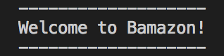
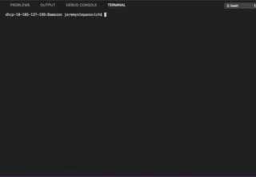

# Bamazon

This application currently allows two separate functionalities:
1) Customer view - check out our inventory and make a purchase directly from our app.
2) Manager view - see available stock, low inventory, restock and add new items to the store as you see fit.

# Instructions
Choose a user and run that Javascript file in node.js. You'll be prompted with a series of options to navigate the store. Take a look around and enjoy!

Here is an example of our customer view:

Here is an example of our manager view:

The supervisor view allows users to see a breakdown of each department in the store, their overhead costs, product sales and total profit from each category. 

# About this project
This project was built using Javascript and node.js for user interaction and mySQL for database infrastructure. Please see the source code for more information.

# Collaborators
Jeremy Stepanovich
https://github.com/jstep1
